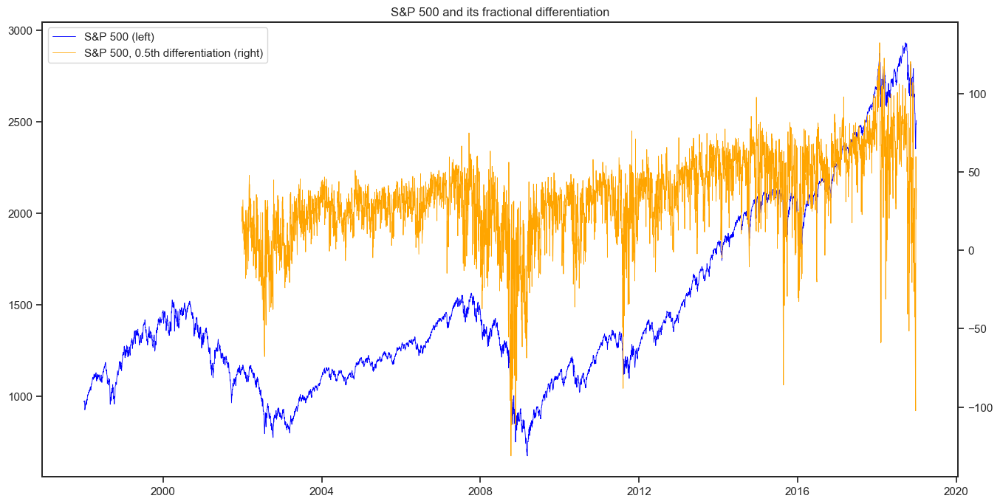
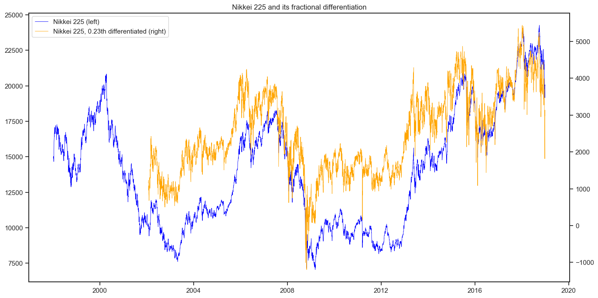

# Fracdiff

[](https://pypi.org/project/fracdiff/)
[](https://travis-ci.com/simaki/fracdiff)
[](https://github.com/simaki/fracdiff/blob/master/LICENSE)

Fractional differentiation of time-series.



## Installation

```sh
$ pip install fracdiff
```

## Features

- Perform fractional differentiation of time-series
- Based on scikit-learn API

## What is fractional differentiation?

...

## How to use

### Fractional differentiation

A transformer class `FracDiff` generates fractional differentiation by its method `transform`.
The following example gives 0.5th differentiation of S&P 500.

```python
from fracdiff import FracDiff

spx = ...  # Fetch 1d array of S&P 500 historical price

fracdiff = FracDiff(0.5)
spx_diff = fracdiff.transform(spx)

spx_diff
```

The result looks like this:


### Differentiation while preserving memory

A transformer class `StationaryFracDiff` finds the minumum order of fractional differentiation that makes time-series stationary.

```python
from fracdiff import StationaryFracDiff

nky = ...  # Fetch 1d array of Nikkei 225 historical price

statfracdiff = StationaryFracDiff()
statfracdiff.fit(nky)

statfracdiff.order_
# 0.23
```

Differentiated time-series with this order is obtained by subsequently applying `transform` method.
This series is interpreted as the stationary time-series keeping the maximum memory of the original time-series.

```python
nky_diff = statfracdiff.transform(nky)  # same with FracDiff(0.23).transform(nky)
```

The method `fit_transform` carries out `fit` and `transform` at once.

```python
nky_diff = statfracdiff.fit_transform(nky)
```

The result looks like this:



Other examples including those in [M. L. Prado's book][prado] can be found in a Jupyter notebook [here](./sample/plot.ipynb).

## References

- [Marcos Lopez de Prado, "Advances in Financial Machine Learning", Wiley, (2018).][prado]

[prado]: https://www.wiley.com/en-us/Advances+in+Financial+Machine+Learning-p-9781119482086
